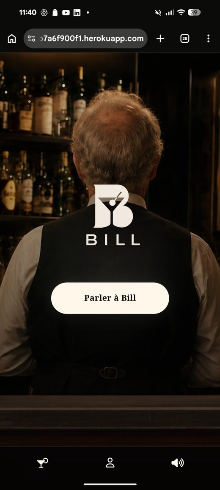
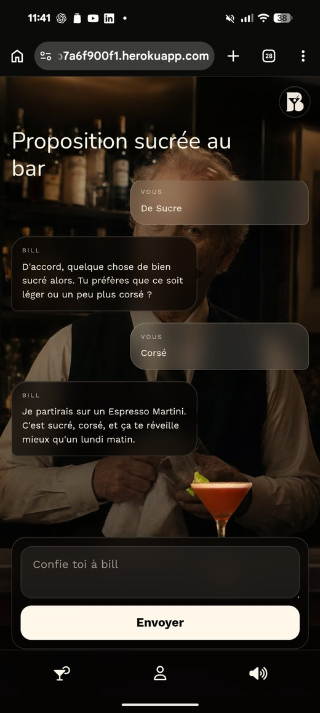
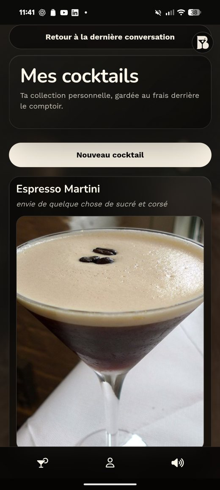
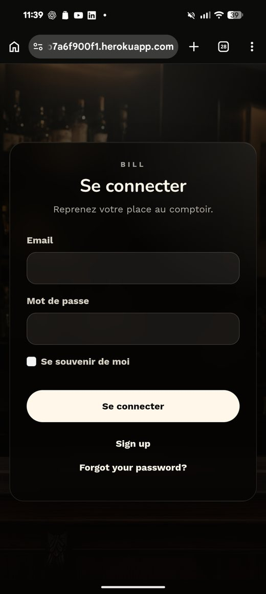

# Bill

[](https://github.com/jcparfait/Bill/actions/workflows/ci.yml)


**Bill** est une application web Rails qui simule un bar conversationnel. L’utilisateur décrit son humeur, ses goûts ou ses contraintes, puis l’application recommande un cocktail réel avec sa recette et ses ingrédients.

Le projet combine une interface Rails / Hotwire, une authentification Devise, une voix conversationnelle pilotée par LLM, une logique métier Ruby pour limiter les coûts en tokens et une intégration avec TheCocktailDB.

> Projet initialement réalisé en formation, puis repris, enrichi et nettoyé pour devenir un projet portfolio présentable à un recruteur.

## Démonstration

- [Application en ligne](https://bill-jcparfait-8fb7a6f900f1.herokuapp.com)
- [Release GitHub v1.0.0](https://github.com/jcparfait/Bill/releases/tag/v1.0.0-demo)

Compte de démonstration :

```text
Email: demo@bill.app
Mot de passe: 123456
```

Le compte contient déjà quelques conversations et cocktails enregistrés afin de montrer le parcours sans partir d’une base vide.

## Aperçu

<p align="center">
  
  
  
</p>

<p align="center">
  
</p>

## Pourquoi ce projet

Bill n’est pas seulement un chatbot. L’application combine :

- une expérience conversationnelle naturelle ;
- une logique métier côté serveur ;
- une API externe pour obtenir des données fiables ;
- une interface responsive avec Turbo Streams ;
- une authentification et une collection personnelle par utilisateur.

## Fonctionnalités principales

- création de compte et connexion avec Devise ;
- discussion avec Bill, un barman fictif au ton calme, ironique et légèrement absurde ;
- compréhension du mood, des préférences et des contraintes d’ingrédients ;
- recommandation d’un cocktail adapté après l’échange ;
- récupération des ingrédients, proportions et instructions depuis TheCocktailDB ;
- carte cocktail interactive pour enregistrer ou passer une recommandation ;
- prévention des doublons dans une conversation et dans la collection personnelle ;
- bibliothèque personnelle de cocktails ;
- historique des conversations ;
- profil utilisateur et gestion du compte ;
- interface responsive desktop et mobile.

## Stack technique

| Partie | Technologies |
| --- | --- |
| Backend | Ruby 3.3.5, Ruby on Rails 8.1 |
| Base de données | PostgreSQL |
| Authentification | Devise |
| UI | Rails views, Hotwire, Turbo Streams, Stimulus |
| Styles | Sass, Bootstrap, Font Awesome |
| IA conversationnelle | RubyLLM, GitHub Models, Azure OpenAI Playground |
| API externe | TheCocktailDB |
| Déploiement | Heroku |
| Tests et qualité | Minitest, GitHub Actions, Brakeman, RuboCop |

## Architecture simplifiée

```text
.
├── app/
│   ├── controllers/       # Chats, messages, cocktails, profil
│   ├── models/            # User, Chat, Message, Cocktail
│   ├── tools/             # RecommendCocktailTool
│   └── views/             # Interface Rails / Hotwire
├── config/
│   ├── routes.rb          # Routes Devise, chats, messages, cocktails
│   └── initializers/      # RubyLLM et fallback cocktail
├── db/                    # Schéma, migrations et seeds
└── test/                  # Tests Rails
```

## Logique de recommandation

Bill utilise l’IA pour la conversation et le ton, mais la recommandation n’est pas laissée entièrement au modèle.

1. Le contrôleur analyse la conversation et demande au LLM une décision structurée : continuer ou recommander.
2. Le LLM renvoie une réponse JSON courte avec l’action, le mood, les tags et les contraintes.
3. Le code Ruby applique les règles métier : exclusions, alcool ou sans alcool, et prévention des doublons.
4. L’application choisit des candidats dans un catalogue interne.
5. TheCocktailDB fournit la fiche réelle du cocktail.
6. Bill formule une recommandation courte, tandis que la carte affiche la recette.

Cette séparation évite que le LLM contrôle toute la logique métier et rend le comportement plus prévisible.

## Points techniques intéressants

- Turbo Streams pour afficher les messages et la carte cocktail sans rechargement complet ;
- séparation entre cocktail proposé et cocktail réellement sauvegardé ;
- fallback Ruby si l’IA ou l’API externe échoue ;
- exclusion des cocktails déjà proposés dans le chat ;
- exclusion des cocktails déjà présents dans la collection utilisateur ;
- prompt court pour réduire la consommation de tokens ;
- pages d’erreur personnalisées `404`, `422` et `500` ;
- configuration Heroku par variables d’environnement.

## Installation locale

Prérequis : Ruby 3.3.5, PostgreSQL, Bundler et un jeton GitHub avec l’autorisation `Models: Read-only` pour activer l’IA.

```bash
bundle install
cp .env.example .env
bin/rails db:create db:migrate db:seed
bin/rails server
```

Puis ouvrir :

```text
http://localhost:3000
```

## Variables d’environnement

```env
GITHUB_TOKEN=github_pat_...
GITHUB_MODELS_API_BASE=https://models.inference.ai.azure.com
GITHUB_MODELS_MODEL=gpt-4o
APP_HOST=localhost:3000
APP_PROTOCOL=http
```

En production Heroku :

```bash
heroku config:set \
  GITHUB_TOKEN=github_pat_... \
  GITHUB_MODELS_API_BASE=https://models.inference.ai.azure.com \
  GITHUB_MODELS_MODEL=gpt-4o \
  APP_HOST=bill-jcparfait-8fb7a6f900f1.herokuapp.com \
  APP_PROTOCOL=https \
  RAILS_LOG_LEVEL=info \
  --app bill-jcparfait
```

## Routes principales

| Domaine | Routes |
| --- | --- |
| Accueil | `GET /` |
| Healthcheck | `GET /up` |
| Auth | routes Devise utilisateurs |
| Conversations | `GET /chats`, `POST /chats`, `GET /chats/:id`, `DELETE /chats/:id` |
| Messages | `POST /chats/:chat_id/messages` |
| Cocktails | `GET /cocktails`, `POST /cocktails`, `GET /cocktails/:id`, `PATCH /cocktails/:id`, `DELETE /cocktails/:id` |
| Profil | `GET /profile` |

## Tests et intégration continue

Commandes utiles :

```bash
bin/rails test
bundle exec brakeman --no-pager
bundle exec rubocop
RAILS_ENV=production bin/rails assets:precompile
```

Le workflow GitHub Actions prépare PostgreSQL et exécute automatiquement la suite de tests Rails à chaque push ou pull request vers `master`.

## Limites connues

- l’IA dépend du quota GitHub Models disponible sur le token configuré ;
- TheCocktailDB peut ne pas contenir exactement toutes les contraintes demandées ;
- les tests automatisés doivent encore être renforcés sur le parcours complet chat et API externe.

## Roadmap

- ajouter des tests d’intégration avec mocks pour TheCocktailDB ;
- améliorer l’accessibilité clavier et les états de focus.
